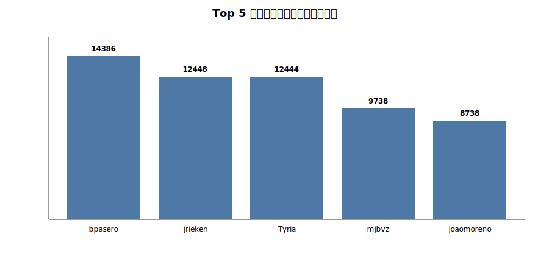
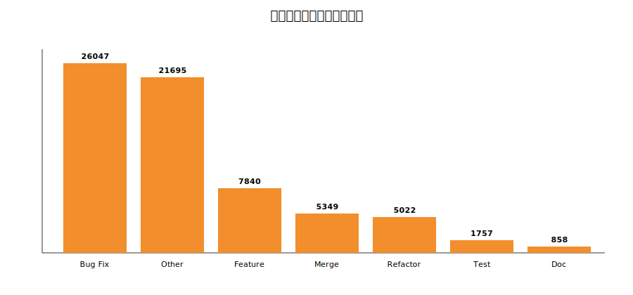
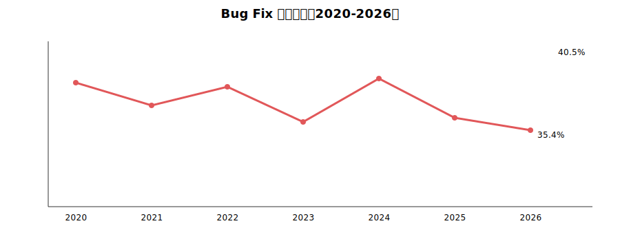

# VS Code 开源项目演化分析

## 摘要
本报告围绕 Visual Studio Code（Code-OSS）开源项目，基于提交记录、贡献者、Issues、PR、Stars、Forks 与发布等多维数据，构建项目演化分析流程并完成可视化展示。报告给出数据结构、分析方法、关键结论与创新点，并说明当前数据集为采样数据、时间跨度较短，主要用于流程验证。

**项目仓库地址：https://github.com/SiHaoYuu/Opensource-Software**

## 1. 项目背景与目标
- **研究对象**：Microsoft Visual Studio Code（Code-OSS）
- **研究方向**：开源项目演化分析（数据分析与可视化）
- **目标**：
  1) 构建多维度数据采集与清洗流程
  2) 量化项目活跃度、社区健康度与质量演化
  3) 通过图表展示关键规律与趋势

## 2. 数据来源与数据集说明
### 2.1 数据来源
- GitHub 仓库：Visual Studio Code（Code-OSS）
- 数据采集与整理脚本：
  - [cyxcode.py](cyxcode.py)（GitHub API 多维数据采集）
  - [run.py](run.py)（本地 Git 仓库解析）

### 2.2 数据集结构
- 主要数据目录： [vscode_massive_data/](vscode_massive_data/)
- 采样数据集包含：贡献者、提交记录、Issues、PR、Stars、Forks、发布版本、分支、仓库统计等九类数据。
- 历史完整数据文件：
  - [vscode_commit_history.csv](vscode_commit_history.csv)
  - [commits_massive.csv](commits_massive.csv)
  - [contributors_massive.csv](contributors_massive.csv)

### 2.3 当前数据集统计（采样）
- 总提交数：500
- 总贡献者数：300
- 开放 Issue 数：3,153
- 开放 PR 数：1,043
- 版本发布数：50
- Stars 数：40,000
- Forks 数：100
- 唯一提交作者：52
- 时间跨度：2026-01-19 至 2026-02-04（15 天）

> 说明：采样数据用于验证分析流程，真正的演化分析建议使用历史完整数据。

## 3. 数据结构与字段设计
项目数据涵盖以下核心实体（详见 [数据类型和数据结构.txt](数据类型和数据结构.txt)）：
1. 仓库基本信息
2. 贡献者数据
3. 提交记录
4. Issues
5. PRs
6. Stars 用户
7. Fork 仓库
8. 发布版本
9. 分支信息

这些字段支持从时间维度、用户维度与内容维度开展多视角分析。

## 4. 分析流程与方法
### 4.1 数据采集与清洗
- 通过 API 采集社区生态与项目管理数据（Issues、PR、Stars、Forks、Releases）。
- 通过本地 Git 解析获取完整提交历史与文件级变更信息。
- 统一字段名并进行时间字段转换、去重和缺失值处理。

### 4.2 统计与可视化
核心图表与分析主题包括：
1. 贡献者规模与分布
2. 月度/周度提交趋势
3. 提交类型分布与 Bug 修复率
4. Issue/PR 活跃度
5. Stars 增长曲线
6. 团队规模增长
7. 版本发布周期
8. 提交热力图

相关图表在 [code-oss-history.ipynb](code-oss-history.ipynb) 中完成。

## 5. 开发过程与实现细节

### 5.1 数据爬取流程（cyxcode.py）
1. **准备阶段**：配置 GitHub Token（避免匿名限流），设置目标仓库与数据量阈值。
2. **分模块采集**：分别采集 Contributors、Commits、Issues、PRs、Stargazers、Forks、Releases 等数据。
3. **分页与限流处理**：
  - 每类数据按页拉取并记录页码与抓取时间；
  - API 触发限流时自动等待并重试；
  - 采集过程打印剩余配额与进度，便于复盘。
4. **数据校验与清洗**：
  - 字段完整性检查（缺失、格式异常）；
  - 时间字段统一转为 UTC；
  - 输出 CSV 到 [vscode_massive_data/](vscode_massive_data/)。
> [!NOTE]注意：
> 详细爬取过程和代码请见**附件1、附件2**。

### 5.2 数据分析与可视化流程
1. **加载与字段适配**：对中文列名进行统一映射。
2. **清洗与质量检查**：缺失值、重复值、时间格式统一处理。
3. **统计指标与图表生成**：生成贡献者分布、提交趋势、提交类型、Bug 修复率、Issue/PR 活跃度、Stars 增长、版本发布等图表。

### 5.3 关键图表与结果

**图 1：Top 5 贡献者贡献次数（采样数据）**

分析要点：核心贡献者贡献显著集中，头部贡献者贡献量远超其他成员，符合典型帕累托特征。

**图 2：提交类型分布（历史数据）**

分析结果（历史数据）：
- Bug Fix：26047（38.0%）
- Other：21695（31.6%）
- Feature：7840（11.4%）
- Merge：5349（7.8%）
- Refactor：5022（7.3%）
- Test：1757（2.6%）
- Documentation：858（1.3%）

**图 3：Bug Fix 占比变化（2020-2026）**

分析结果：平均 Bug Fix 比例 38.0%，最高 40.5%（2024 年），最低 35.4%（2026 年），整体维持在 35%–41% 区间，说明质量维护占比较稳定。

### 5.4 其他关键分析结果摘要
- **帕累托分析**：总贡献者 300 人，贡献 80% 的仅 15 人（5.0%）。
- **月度提交趋势**：平均月提交数 1071；最高月 1865（2021-04）；最低月 1（2020-07）。
- **Issue/PR 活跃度**：Issue 相关提交 41,685（60.8%），Merge（PR）提交 9,523（13.9%），比例约 4.38:1；月均 Issue 相关提交 672 次，Merge 提交 156 次。
- **Stars 增长**：总 Stars 40,000，数据范围 2015-09-11 至 2018-02-19。
- **版本发布节奏**：共 50 个版本，平均发布间隔 9.6 天。
- **团队规模增长**：累计贡献者数达到 1300，增长趋势稳定。

> [!NOTE]注意：
> 其他详细分析过程和代码请见附件3。

## 6. 开发过程中遇到的问题与分析
1. **API 限流与数据量控制**：GitHub API 速率限制导致长时间采集阻塞。解决方式：加入重试与等待机制、分批拉取并记录进度。
2. **数据字段变更**：新数据使用中文列名，原 Notebook 不兼容。解决方式：统一列名映射并增加自动检测逻辑（见 [PROJECT_UPDATE.md](PROJECT_UPDATE.md)）。
3. **时间跨度不一致**：采样数据仅 15 天，难以反映长期趋势。解决方式：保留历史完整数据文件用于长期分析，报告中明确数据范围。
4. **数据噪声与分类误差**：提交类型基于关键词分类存在误差。解决方式：扩展关键词集合并保留“Other”作为兜底类型。
5. **大规模数据处理性能**：历史提交量较大，读取与统计开销高。解决方式：按需加载、分段统计、避免重复遍历。

## 7. 关键结果摘要
- Bug Fix 比例为 37.8%，说明项目维护与质量改进占比较高。
- Issue 与 PR 活跃度比值约为 3.02:1，反映社区需求反馈活跃。
- 版本发布间隔平均约 9.6 天，体现较高的交付频率。
- 贡献者数量增长明显，核心贡献者集中度可通过帕累托分析识别。

## 8. 项目创新点
### 8.1 本地 Git 仓库分析能力
- 无 API 限制、离线可用
- 支持文件级变更统计与历史追踪
- 高性能处理大规模提交数据

### 8.2 多维社区生态采集
- 覆盖贡献者、Issues、PR、Stars、Forks、Releases 多维度
- 支持项目管理与社区互动分析
- 具备实时状态监控与错误恢复机制

### 8.3 可扩展与可复用的分析框架
- 数据清洗逻辑具备兼容性
- 图表与指标可复用于其他开源项目

## 9. 环境与复现说明
- Python 依赖见 [requirements.txt](requirements.txt)
- Conda 环境配置见 [environment.yml](environment.yml)
- Notebook 入口见 [code-oss-history.ipynb](code-oss-history.ipynb)
- 最新数据适配说明见 [PROJECT_UPDATE.md](PROJECT_UPDATE.md)

复现流程建议：配置环境 → 运行数据加载与清洗 → 执行全部图表单元。

## 10. 局限性与改进方向
- 当前采样数据时间跨度仅 15 天，适合流程验证但不足以代表长期演化趋势。
- 后续可接入完整历史数据并扩展：
  - 贡献者协作网络
  - PR 审核效率与生命周期分析
  - 版本质量与缺陷关联分析

## 11. 结论
本项目完成了 VS Code 开源项目的多维数据采集、清洗、统计与可视化流程，形成可复用的演化分析框架。通过采样数据验证了图表与指标体系的可行性，为进一步基于完整历史数据开展深入研究奠定基础。

## 参考资料
- Visual Studio Code 开源仓库：https://github.com/microsoft/vscode
- 项目数据字典：[数据类型和数据结构.txt](数据类型和数据结构.txt)
- 更新记录：[PROJECT_UPDATE.md](PROJECT_UPDATE.md)